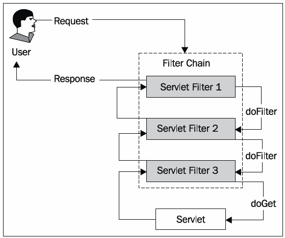

## 스프링 시큐리티 spring security ?

- 스프링 기반의 어플리케이션의 보안(인증과 권한)을 담당하는 프레임워크
- 보안과 관련해서 체계적으로 많은 옵션들로 지원
- filter 기반으로 동작하기 때문에 sprint MVC와 분리되어 관리 및 동작
- security 3.2부터는 XML로 설정하지 않고도 자바 bean 설정으로 간단하게 설정할 수 있도록 지원

**용어**

```
> 접근주체 principal
      보호된 대상에 접근하는 유저

> 인증 authenticate
      현재 유저가 누구인지 확인, 어플리케이션의 작업을 수행할 수 있는 주체임을 증명

> 인가 authorize
      현재 유저가 어떤 서비스, 페이지에 접슨할 수 있는 권한이 있는지 검사

> 권한
      인증된 주체가 애플리케이션의 동작을 수행할 수 있도록 허락되어있는지를 결정
      권한 승인이 필요한 부분으로 접근하려면 인증 과정을 통해 주체가 증명 되어야만 한다
      권한 부여에도 두가지 영역이 존재하는데 웹 요청 권한, 메소드 호출 및 도메인 인스턴스에 대한 접근 권한 부여


```

> ∴ 권한 승인이 필요한 부분으로 접근하려면 인증 과정을 통해 주체가 증명되어야만 한다.

## 구조

- 인증관련 아키텍쳐


sprint security는 세션-쿠키방식으로 인증한다.

1. 유저가 로그인 시도 (http request)
2. filter ~ user db 진행
3. 유효한 유저일 경우 userDetails 로 꺼내서 유저의 session 생성
4. sprint security의 인메모리 세션저장소인 securityContextHolder 에 저장
5. 유저에게 session ID 와 함께 응답
6. 이후 요청에서는 요청쿠키에서 JSESSIONID를 까봐서 검증 후 유효하면 권한을 쥐어준다.

## security filter



```
1. SecurityContextPersistenceFilter
   SecurityContextRepository에서 SecurityContext를 가져오거나 저장하는 역할을 한다.

```

```
2. LogoutFilter
   설정된 로그아웃 URL로 오는 요청을 감시하며, 해당 유저를 로그아웃 처리

```

```
3. (UsernamePassword)AuthenticationFilter
   (아이디와 비밀번호를 사용하는 form 기반 인증) 설정된 로그인 URL로 오는 요청을 감시하며, 유저 인증 처리 AuthenticationManager를 통한 인증 실행
   - 인증 성공 시, 얻은 Authentication 객체를 SecurityContext에 저장 후 AuthenticationSuccessHandler 실행
   - 인증 실패 시, AuthenticationFailureHandler 실행

```

```
4. DefaultLoginPageGeneratingFilter
   인증을 위한 로그인폼 URL을 감시.

```

```
5. BasicAuthenticationFilter
   HTTP 기본 인증 헤더를 감시하여 처리.

```

```
6. RequestCacheAwareFilter
   로그인 성공 후, 원래 요청 정보를 재구성하기 위해 사용.

```

```
7. SecurityContextHolderAwareRequestFilter
   HttpServletRequestWrapper를 상속한 SecurityContextHolderAwareRequestWapper 클래스로 HttpServletRequest 정보를 감싼다. SecurityContextHolderAwareRequestWrapper 클래스는 필터 체인상의 다음 필터들에게 부가정보를 제공한다.

```

```
8. AnonymousAuthenticationFilter
   이 필터가 호출되는 시점까지 사용자 정보가 인증되지 않았다면 인증토큰에 사용자가 익명 사용자로 나타난다.

```

```
9. SessionManagementFilter
   이 필터는 인증된 사용자와 관련된 모든 세션을 추적한다.

```

```
10. ExceptionTranslationFilter
   이 필터는 보호된 요청을 처리하는 중에 발생할 수 있는 예외를 위임하거나 전달하는 역할을 한다.

```

```
11. FilterSecurityInterceptor
   이 필터는 AccessDecisionManager 로 권한부여 처리를 위임함으로써 접근 제어 결정을 쉽게해준다.

```

## Authentication

모든 접근 주체는 Authentication를 생성한다. <br>
이것은 securityContext에 보관되고 사용된다.
즉 security의 세션들을 내부 메모리(securityContextHolder)에 쌓고 꺼내쓰는 것이 좋다.

> ```
>  * 자주쓰는 인터페이스
>
> public interface Authentication extends Principal, Serializable {
>     Collection<? extends GrantedAuthority> getAuthorities(); // Authentication 저장소에 의해 인증된 사용자의 권한 목록
>     Object getCredentials(); // 주로 비밀번호
>     Object getDetails(); // 사용자 상세정보
>     Object getPrincipal(); // 주로 ID
>     boolean isAuthenticated(); //인증 여부
>     void setAuthenticated(boolean isAuthenticated) throws > IllegalArgumentException;
> }
>
> ```

## AuthenticationManager


- AuthenticationManager : 인증요청을 받고 Authentication를 채운다.<br>
- AuthenticationProvider : 실제 인증이 일어나며, 성공하면 Authentication.isAuthenticated = true 를 한다.<br>

유저의 요청 내에 담긴 Authentication을 AuthentiucationManager에 넘겨주고, AuthenticationManager를 구현한 ProviderManager가 처리한다.<br>
정확히는 ProviderManager는 private List<AuthenticationProvider> providers; 로 여러 AuthenticationProvider를 가질 수 있는데, 이 친구들이 처리를 해서 Authentication 를 반환해준다. (실패하면 예외던짐)
